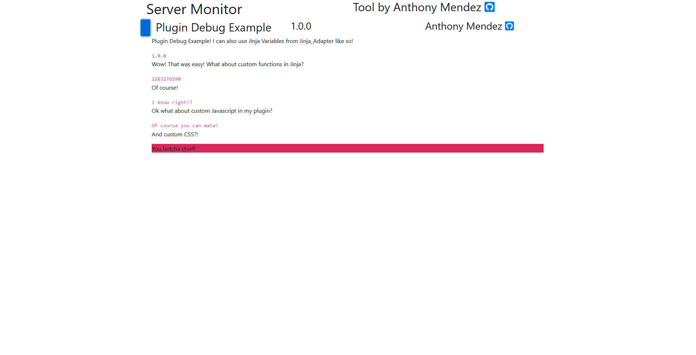

# Server Manager

## Contributors

*   Anthony Mendez

## What is Server Manager?

Server Manager is an open-ended website tool based on Python Plugins you can create yourself, or download from others.

## How do I use Server Manager?

Just download the project, and in a terminal run

`py debug.py`

or

`py run.py`

then you can navigate to `127.0.0.1:5000` and see the website appear. 

More configurability coming soon!

## How can I create a plugin with Server Manager?

Take a look at `plugin_debug_example` plugin to get an idea of what you can do with the plugin.

I'm currently working on a HWiNFO64 remote sensor reader that extracts data from HWiNFO64 and displays the data on the tool.

## How do I add a plugin I downloaded?

Just place the plugin into the plugins folder!

## Are the SSL Keys necessary?

No, but if you're going to be hosting the site and want to access it anywhere, you can use it to ensure you're connected to the correct server.

## How does it look?

You can see a preview at <http://www.anthonymendez.duckdns.org/>

Like this!

